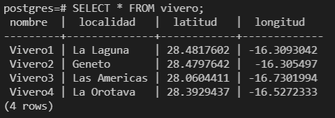
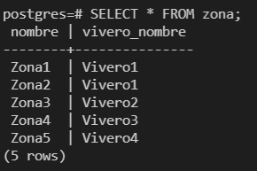
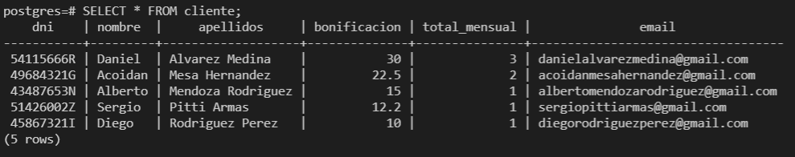
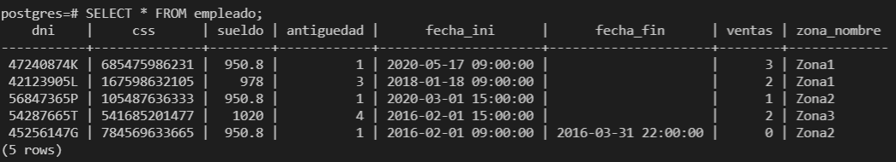
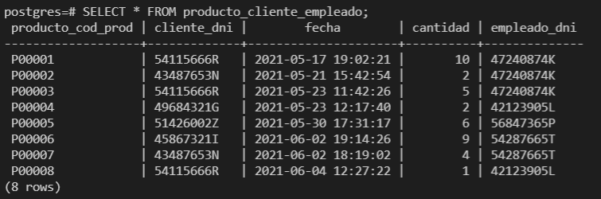
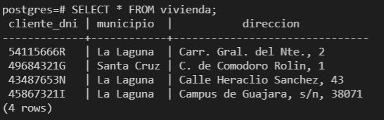

## SELECT de la tabla _vivero_ 

## SELECT de la tabla _zona_

## SELECT de la tabla _producto_

## SELECT de la tabla _cliente_

## SELECT de la tabla _empleado_

## SELECT de la tabla _producto_zona_

## SELECT de la tabla _producto_cliente_empleado_

## SELECT de la tabla _vivienda_

