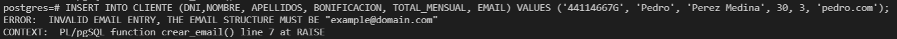
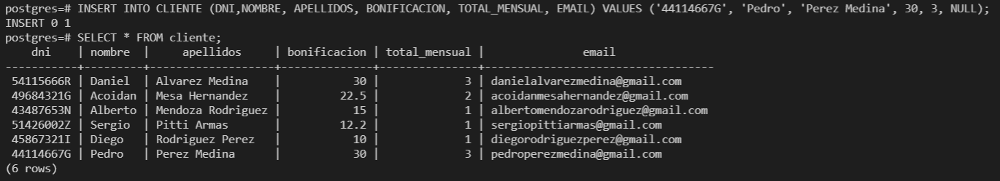
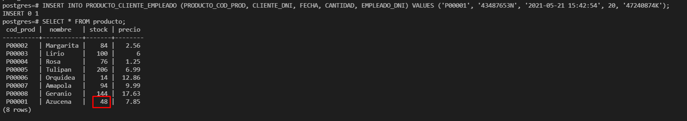
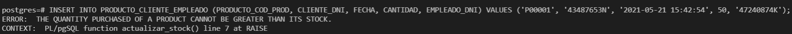
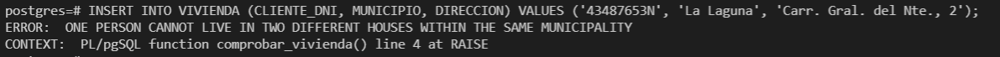

## SELECT de la tabla _vivero_ 

## SELECT de la tabla _zona_

## SELECT de la tabla _producto_

## SELECT de la tabla _cliente_

## SELECT de la tabla _empleado_

### Comprobar sintaxis del email:

### Insertar mediante email nulo:

## SELECT de la tabla _producto_zona_

## SELECT de la tabla _producto_cliente_empleado_

### Actualizar el stock de los productos en la tabla _producto_:

Se puede apreciar en la tabla [_producto_](https://github.com/alu0101216126/ADBDD/blob/main/Modelo%20Lógico%20Relacional%20(Disparadores)/Capturas/SELECT_producto.png) que antes el stock de las azucenas era 68, sin embargo, tras comprar 20 de estas, su stock es 48

### No poder comprar cantidades superiores al stock:

## SELECT de la tabla _vivienda_

### Comprobar que las personas en el Municipio del catastro no pueden vivir en dos viviendas diferentes:

