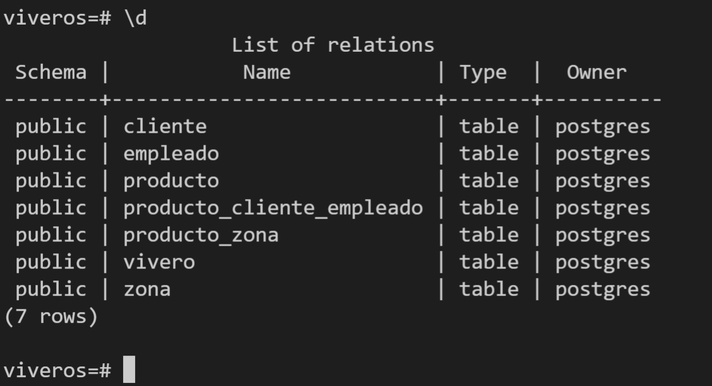
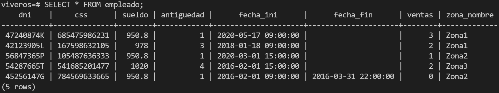
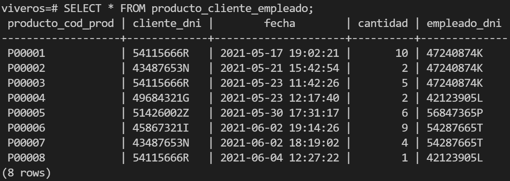

# Salida de un SELECT de cada tabla de la base de datos

### Tablas que forman la base de datos vivero:

### SELECT de la tabla vivero:

### SELECT de la tabla zona:

### SELECT de la tabla producto:

### SELECT de la tabla cliente:

### SELECT de la tabla empleado:

### SELECT de la tabla producto_zona:

### SELECT de la tabla producto_cliente_empleado:

